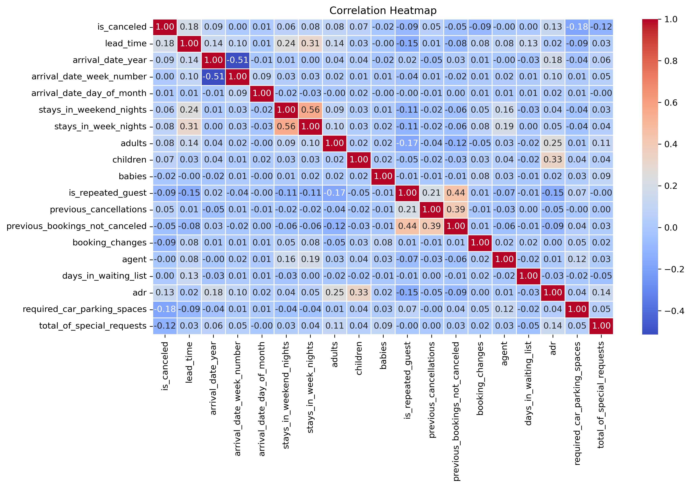
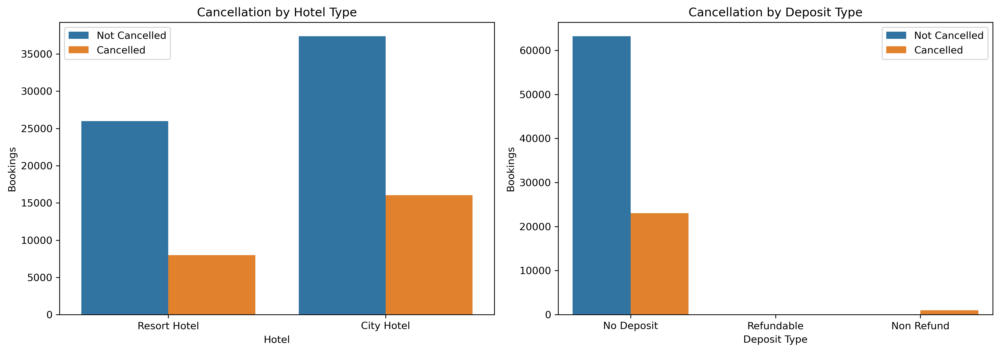
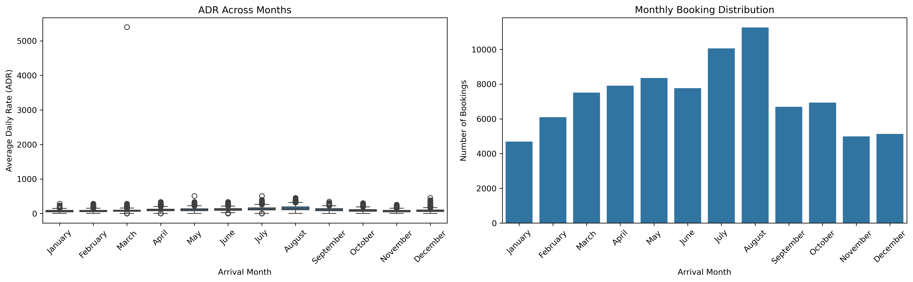
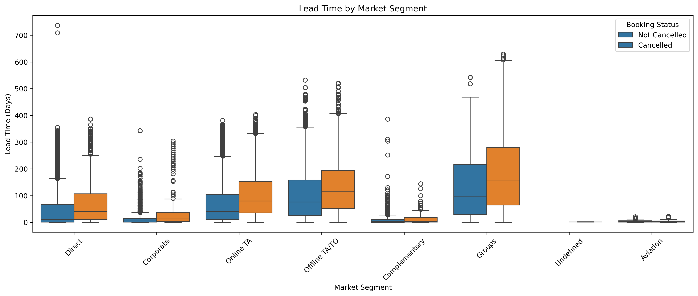
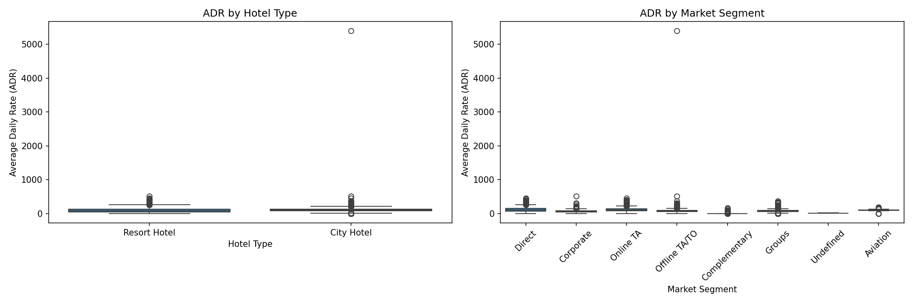
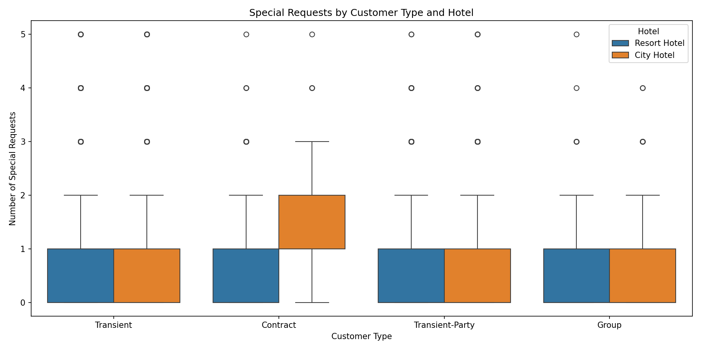

# Hotel Booking Analytics

> A structured Exploratory Data Analysis (EDA) project on the Hotel Booking Demand dataset to understand booking behavior, pricing patterns, cancellation trends, and customer preferences.

> **Project Note:** This repository is organized as a step-by-step EDA workflow. Each notebook represents a specific stage of the analysis, starting from understanding the dataset and ending with business insights. This structure reflects the complete analytical process followed throughout the project.

---

# About the Project

Exploratory Data Analysis is one of the most important stages of any data-driven project. Before building predictive models or drawing conclusions, it is essential to understand the quality of the data, identify patterns, and explore the relationships between variables.

For this project, I worked with the **Hotel Booking Demand** dataset because it provides a realistic business scenario involving customer reservations, hotel operations, pricing strategies, booking cancellations, and seasonal demand.

Rather than performing the complete analysis in a single notebook, I divided the project into multiple stages. Each notebook focuses on a specific part of the workflow, making the analysis easier to follow, reproduce, and maintain.

Throughout the analysis, I explored questions such as:

- How do booking patterns differ between city hotels and resort hotels?
- Which factors appear to influence booking cancellations?
- How does room pricing vary across different customer groups and market segments?
- What seasonal trends can be observed in hotel bookings?
- Which observations can support better business decisions?

The goal of this project was not only to create visualizations but also to develop a structured understanding of the dataset and summarize the analysis into meaningful business insights.

---

# Quick Overview

| Category | Details |
|----------|---------|
| Project Type | Exploratory Data Analysis (EDA) |
| Domain | Hospitality Analytics |
| Dataset | Hotel Booking Demand |
| Language | Python |
| Libraries | Pandas, NumPy, Matplotlib, Seaborn |
| Environment | Jupyter Notebook |
| Version Control | Git & GitHub |

---

# Dataset Information

The analysis is based on the **Hotel Booking Demand** dataset, which contains booking records for both **City Hotel** and **Resort Hotel**.

The dataset includes information related to:

- Hotel type
- Reservation details
- Customer demographics
- Stay duration
- Market segment
- Deposit type
- Average Daily Rate (ADR)
- Booking cancellations
- Special requests

Before beginning the analysis, missing values were handled, duplicate records were removed, and the dataset was prepared for further exploration.

---

# Repository Structure

```text
Hotel-Booking-Analytics/
│
├── data/
│
├── notebooks/
│   ├── 01_Data_Understanding.ipynb
│   ├── 02_Data_Cleaning.ipynb
│   ├── 03_Univariate_Analysis.ipynb
│   ├── 04_Bivariate_Analysis.ipynb
│   ├── 05_Multivariate_Analysis.ipynb
│   └── 06_Business_Insights.ipynb
│
├── visuals/
│   ├── correlation_heatmap.png
│   ├── cancellation_analysis.png
│   ├── lead_time_by_market_segment.png
│   ├── monthly_booking_analysis.png
│   ├── adr_by_hotel_market_segment.png
│   └── special_requests_by_customer_type.png
│
├── README.md
├── requirements.txt
└── .gitignore
```

---

# Analysis Workflow

### 01 • Data Understanding

- Explored the dataset structure
- Reviewed feature information
- Identified missing values
- Examined duplicate records
- Generated descriptive statistics

### 02 • Data Cleaning

- Handled missing values
- Removed duplicate records
- Prepared the dataset for analysis

### 03 • Univariate Analysis

- Explored the distribution of individual variables
- Analyzed booking characteristics and customer information

### 04 • Bivariate Analysis

- Investigated relationships between pairs of variables
- Explored pricing trends, booking behavior, and cancellation patterns

### 05 • Multivariate Analysis

- Examined relationships among multiple variables
- Identified deeper patterns across hotel operations and customer behavior

### 06 • Business Insights

- Summarized analytical observations
- Presented insights supported by the analysis

---

# Analysis Highlights

The following visualizations summarize some of the key analyses performed during the project.

<table>
<tr>
<td align="center">
<b>Correlation Heatmap</b><br><br>

</td>

<td align="center">
<b>Cancellation Analysis</b><br><br>

</td>
</tr>

<tr>
<td align="center">
<b>Monthly Booking Analysis</b><br><br>

</td>

<td align="center">
<b>Lead Time by Market Segment</b><br><br>

</td>
</tr>

<tr>
<td align="center">
<b>ADR by Hotel & Market Segment</b><br><br>

</td>

<td align="center">
<b>Special Requests by Customer Type</b><br><br>

</td>
</tr>
</table>

---

# Key Findings

The exploratory data analysis highlighted several meaningful patterns within the dataset.

- Booking cancellations vary across hotel types and deposit policies.
- Longer booking lead times are more common among cancelled bookings across several market segments.
- Room prices differ across hotel types and market segments.
- Hotel bookings show noticeable seasonal trends throughout the year.
- Customer booking behavior varies across customer categories based on the number of special requests.

These observations demonstrate how exploratory data analysis can help understand customer behavior and support data-driven decision-making in the hospitality industry.

---

# Technologies Used

- Python
- Pandas
- NumPy
- Matplotlib
- Seaborn
- Jupyter Notebook
- Git
- GitHub

---

# Getting Started

Clone the repository.

```bash
git clone https://github.com/Pallavi415/Hotel-Booking-Analytics.git
```

Move into the project directory.

```bash
cd Hotel-Booking-Analytics
```

Install the required libraries.

```bash
pip install -r requirements.txt
```

Launch Jupyter Notebook.

```bash
jupyter notebook
```

Open the notebooks in numerical order to follow the complete analysis workflow.

---

# Future Improvements

Some possible extensions of this project include:

- Develop a machine learning model to predict booking cancellations.
- Build an interactive dashboard using Power BI or Tableau.
- Perform customer segmentation using clustering techniques.
- Deploy the project using Streamlit for interactive data exploration.

---

# Authors

## Pallavi Dahiya

**B.Tech – Computer Science and Engineering (Data Science)**

This project reflects my approach to performing structured exploratory data analysis on a real-world business dataset. The focus was not only on creating visualizations but also on understanding the data, documenting each stage of the analysis, and presenting observations that could support informed business decisions.